# The Story of .NET 
- .NET Framework is a software development framework for building and running applications on Windows.

-  Microsoft .NET Core is a free, open-source, general-purpose development platform to build cloud-based software applications on Windows, Linux, and macOS whereas  Microsoft’s .Net Framework is a software development platform for building and running Windows applications.

# Description
- Porting Assistant for .NET is an analysis tool that scans .NET Framework applications and generates a .NET Core compatibility assessment, helping you port your applications to Linux faster. Porting .NET Framework applications to .NET Core helps customers take advantage of the performance, cost savings, and robust ecosystem of Linux. However, porting applications to .NET Core can be a significant manual effort. Application owners need to spend valuable time identifying the dependencies and APIs that are incompatible with .NET Core, and estimating the level of effort involved. Porting Assistant for .NET quickly scans .NET Framework applications to identify incompatibilities with .NET Core, finds known replacements, and generates a detailed compatibility assessment. This reduces the manual effort involved in modernizing your applications to Linux.

## Challenges moving from .NET framework to .NET
- Incompatible .NET API calls
- Incompatible NuGet packages
- Difficultiy in assessing .NET portability
- Manual work in porting to .NET
  
# Installation 
- Porting Assistant for .NET is fully open-sourced.
- You can use the Porting Assistant in any of those flavors:
    -   [Standalone client](https://aws.amazon.com/porting-assistant-dotnet/) 
    -   [Visual Studio IDE extension](https://marketplace.visualstudio.com/items?itemName=AWSPA.AWSPortingAssistant2022) 
# Prerequisites
- .NET 6 SDK Download from [here](https://dotnet.microsoft.com/en-us/download/dotnet)
- Windows 7 or later
- Internet connectivity on the machine running the assessment
- If your machine is behind a proxy with restricted internet access, you must permit access to the following:

    - [Amazon S3 Datastore](https://s3.us-west-2.amazonaws.com/aws.portingassistant.dotnet.datastore/)
    - [Amazon S3 Datastore authenticaiton endpoint]( https://encore-telemetry.us-east-1.amazonaws.com/)
    - [GitHub datastore](https://github.com/aws/porting-assistant-dotnet-datastore/tree/master/data)
    - [GitHub user content](http://raw.githubusercontent.com/)
    - NuGet or additional package addresses — any addresses required to restore your project packages (the most common one being api.nuget.com)

- Administrator access
- Processor with 1.8 GHz or above processing speed
- 4 GB minimum of available memory (We would need higher memory requirments as long as the solution is larger)
- 5 GB minimum of free disk space
  
# Working flow
## Using the Stanalone Client
- Here I will show how to use the Porting Assitant Stanalone Client

### Installation
- Download and Install the .NET Porting Assistant from [here](https://aws.amazon.com/porting-assistant-dotnet/)

### Assess The Solution
- Open the porting assistant
- Click on `Getting Started` Button 
 
- You should see `Assess New Solution` Page or Click on `Assess a New Solution` button to view it 
 
- Click on `Choose file` and locate the solution file of your project that you want to modernize ,it must be a `.sln` file
- The porting assistant will start scanning and analyzing the application
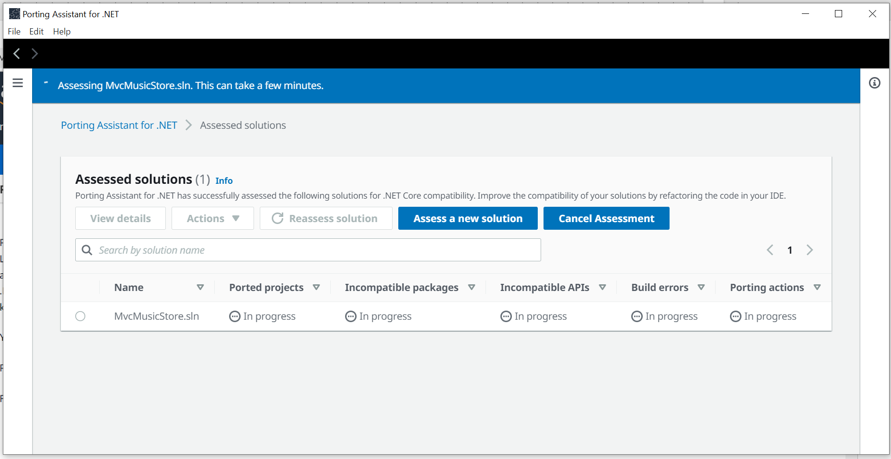
- Wait for some time till the porting assistant finishes assessing the app, this time depends on the size of the application

- Let's review the assessed solution 
- Click on the solution name from the `Assessed solutions` page
- You would see the Assessment overview at the top of the page, with statistics about :
    - Incompatible NuGet packages
    - Incompatible APIs
    - Build errors
    - Porting Actions
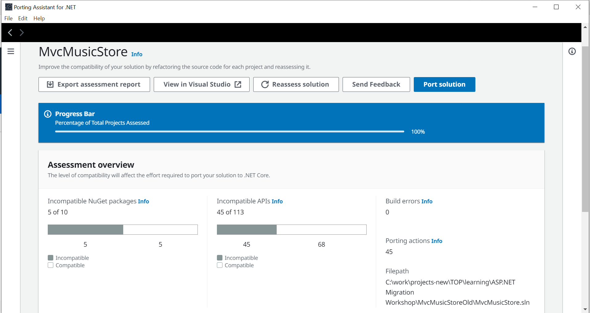
- At the bottom of the page you would see:
    - Included Projects summary with breif about each project including:
        - Framework Version
        - Referenced Projects
        - Incompataible packages
        - Incompatabile APIs
        - Build errors
        - Porting Actions
        - Port Status
         
    

    - Project Reference Graph ,which shows the dependency graph of the included project in the solution
    

    - NuGet Packages with some information about the used packages in the solution including:
        - Name
        - Version
        - Projects (Number of projects in which this package is used)
        - Source Files (Number of files in which this package is used)
        - APIs (Number of apis used from this package )
        - Status (Either compatible or Incompatible)
        - Suggested Replacement (Suggested package version to replace the used package with )  
             
      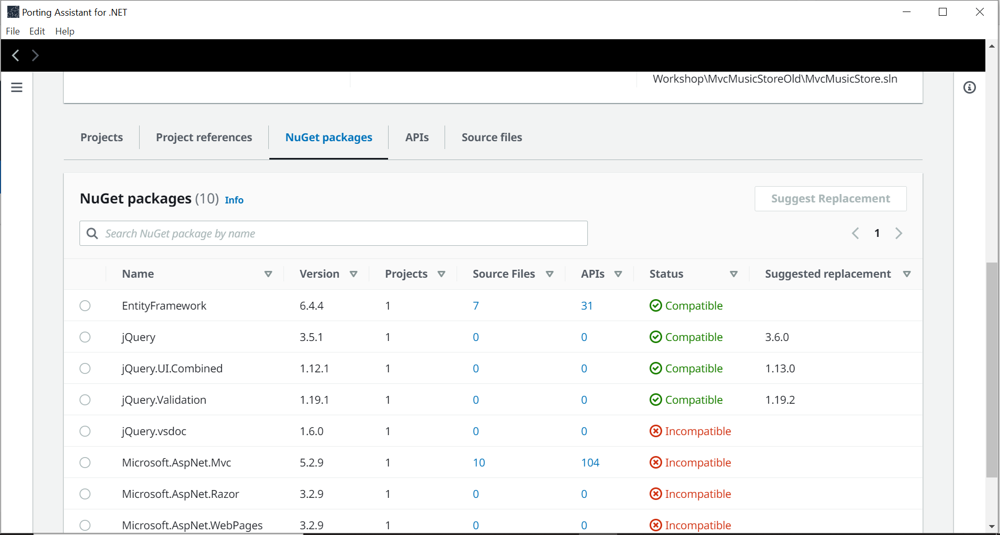

    - APIs with some information about the used apis in the solution including:
        - Name
        - Package
        - Source Files (Number of files in which this api is used)
        - Calls (Number of calls to this api )
        - Status (Either compatible or Incompatible)
        - Suggested Replacement (Suggested api to replace the used api with)        
         
      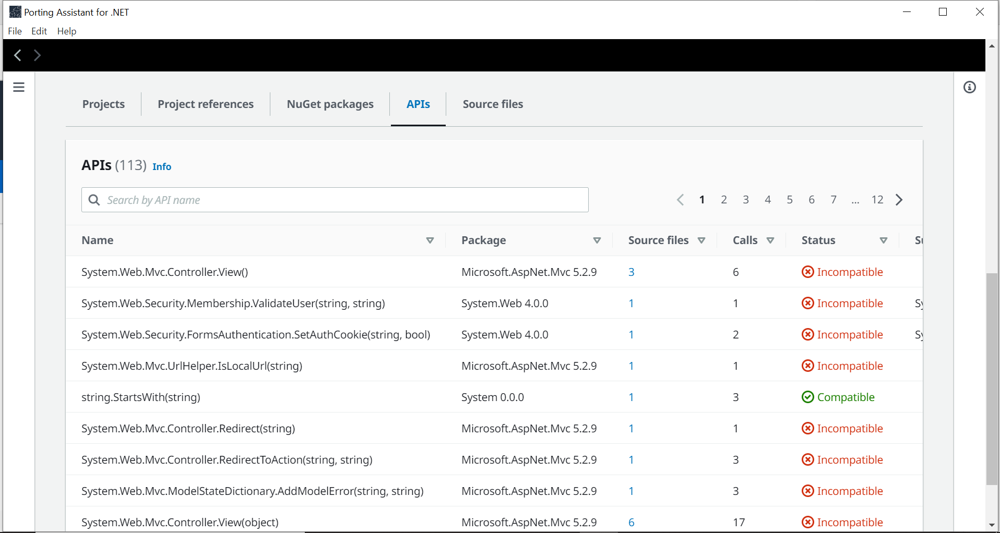

    - Source Files with some information about the used files in the solution including:
        - Source File Name
        - Incompatible API calls (Statistics about `Number of incompatible api calls / Total number of api calls` used in the file)     
         
      

- You could click on the file name from `Source Files` or select the file and click on `View Details` to view the file with the Porting Assistant notes and recommendations
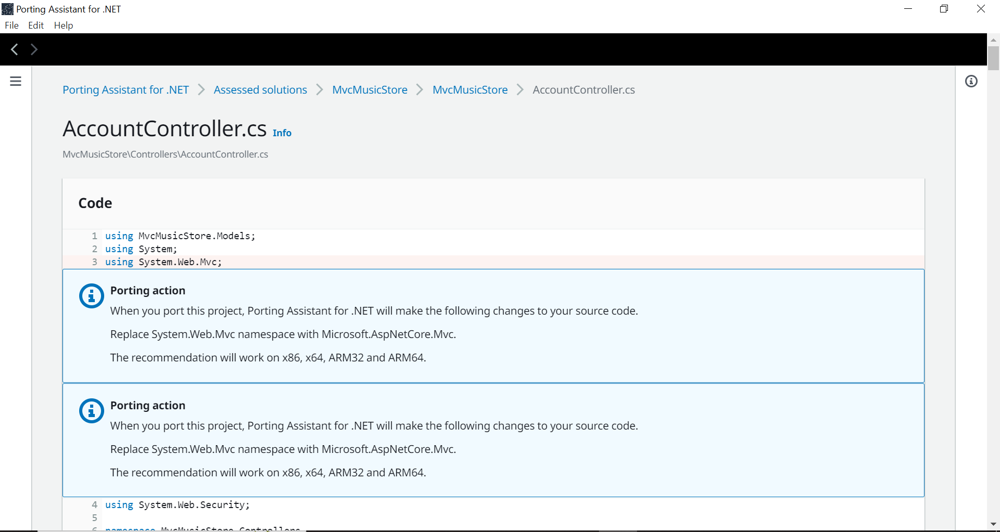

  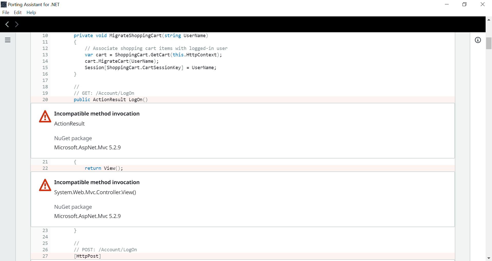

### Port the solution
- The Porting Assistant can help you porting the application by applying some porting actions like upgrading packages , replacing incompatible api calls,..etc but there still some actions that needs to be done manually and you could ust the Porting Assistant to help identify those actions  
- Click on the solution name from the `Assessed solutions` page and click on `Port Solution` Button , Then choose Either to Modify in place or Copy to new location and choose the location path 
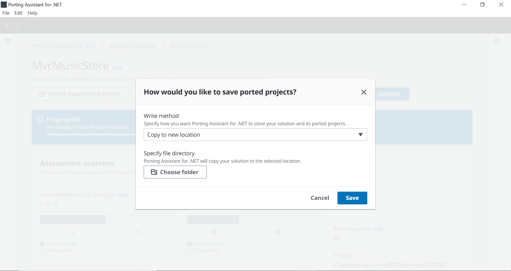
- You will be directed to a page where you can view some porting settings and NuGet packages upgrade
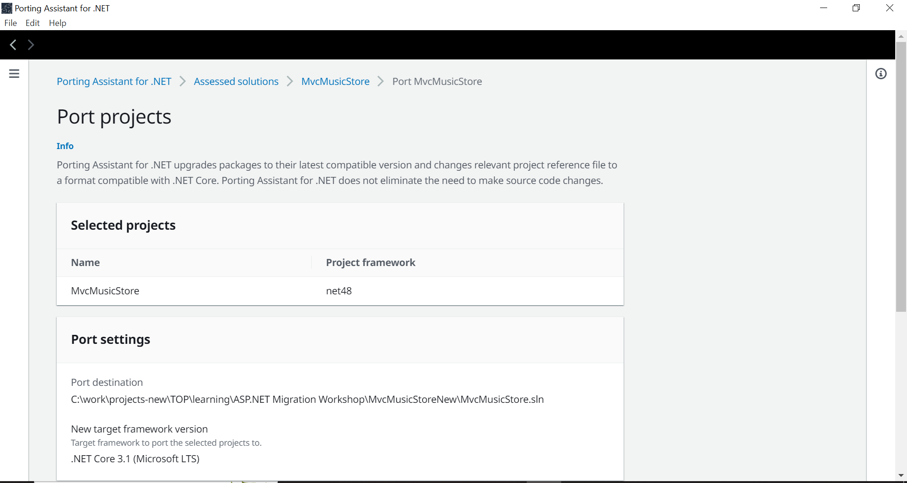
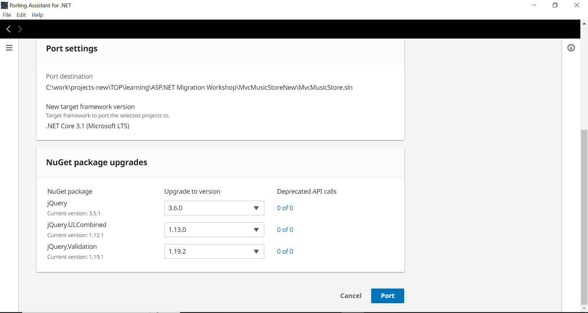
- Then the porting Assistant will start porting your solution
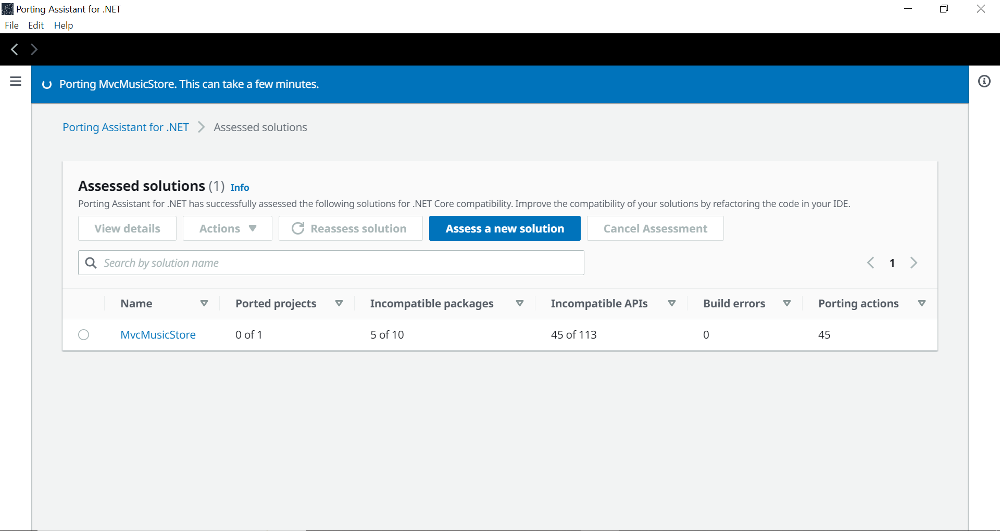
- After Porting is completed , it will automatically start assessing the ported solution and you will see the ported solution in the `Assessed Solutions` 
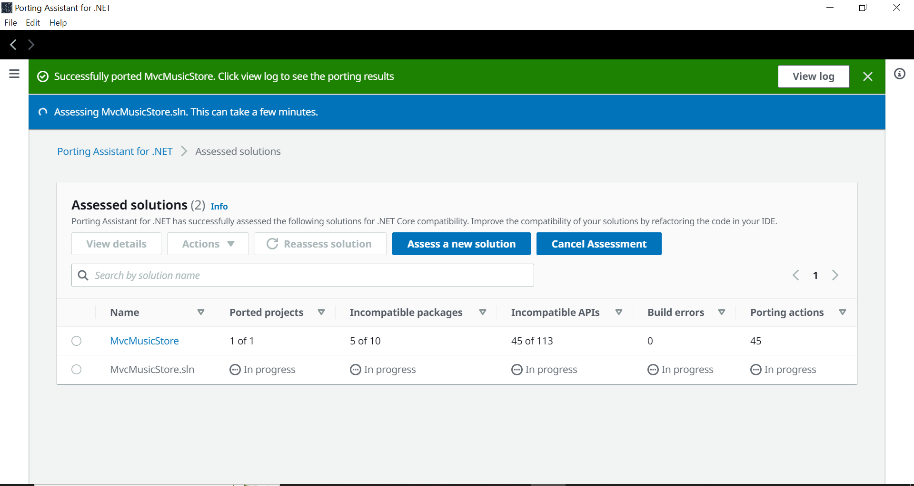
- Wait for some time till the ported solution is fully assessed
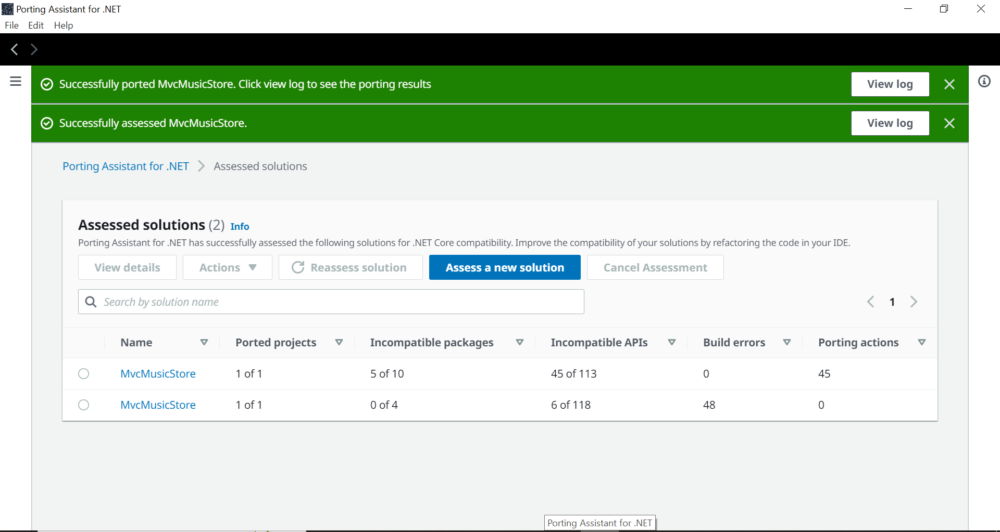

- As you could see the Porting Assistant has already helped in porting some functionalities not all the entire solution ,we still need some manual actions to complete porting the app 

# Resources
- [Porting Assistant for .NET Documentation](https://aws.amazon.com/porting-assistant-dotnet/)
- [Port .NET applications from .NET Framework to .NET Core | AWS Events](https://www.youtube.com/watch?v=JDGc6-v-yPA)
- [Porting Assistant Prerequisites](https://docs.aws.amazon.com/portingassistant/latest/userguide/porting-assistant-prerequisites.html)